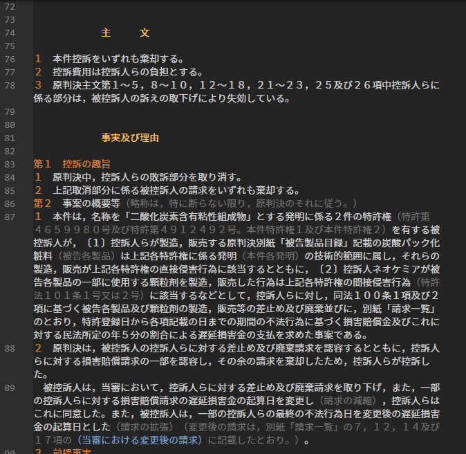

# HanreiHighlight README

判例その他のテキストのハイライト表示

## 機能

判決の構成パートの開始を現す文字列（「主文」「当裁判所の判断」など）や、章・節の開始番号やタイトルなどをハイライト表示します。



- 留意点
	- 上のスクリーンショット画像は[Darcula Theme
](https://marketplace.visualstudio.com/items?itemName=rokoroku.vscode-theme-darcula)というテーマを適用した場合のものです。テーマが変わると、ハイライト表示の配色も変わります。
	- 括弧書きも一応ハイライト表示しますが、完璧ではありません。

## 使い方
判決のテキストデータをVSCodeにコピー＆ペーストして、テキストファイル（.txt）として保存すると、ハイライト表示されるようになります。

## アウトライン表示（CodeMapを使う）
この拡張を入れただけでは、サイドパネルにアウトラインを表示することはできません。アウトライン表示については、CodeMapという[拡張機能](https://marketplace.visualstudio.com/items?itemName=oleg-shilo.codemap)をインストールすることで可能になります。私はこの拡張機能をインストールして、`settings.json`に下記のように記述しています：

```
 {
＜省略＞
  "codemap.txt": [
      {
        "pattern": "^[ 　]*第?[一二三四五六七八九十百〇0-9０-９アイウエオカキクケコ\\(\\)（）]+[\\-－0-9０-９]*[ 　\\)）．]+.{0,12}",
        "icon": "function"
      },
      {
        "pattern": "^[ 　]*[^ 　]{0,10}(判[ 　]+決|主[ 　]*文|理[ 　]*由|事[ 　]*実|当裁判所の判断|争点に対する判断|上告.+の上告理由)[ 　]*$",
        "clear": "^[ 　]{0,20}",
         "icon": "class"
      },
      {
        "pattern": "^[ 　]*[<＜【〔［].+[>＞】〕］][ 　]*$",
        "icon": "none"
      }
      ],
＜省略＞
 }
```
すると、下の画像のようになります。


詳細についてはCodeMapの[wiki](https://github.com/oleg-shilo/codemap.vscode/wiki/Adding-custom-mappers)を参照してください。


## Release Notes

### 1.0.0
公開